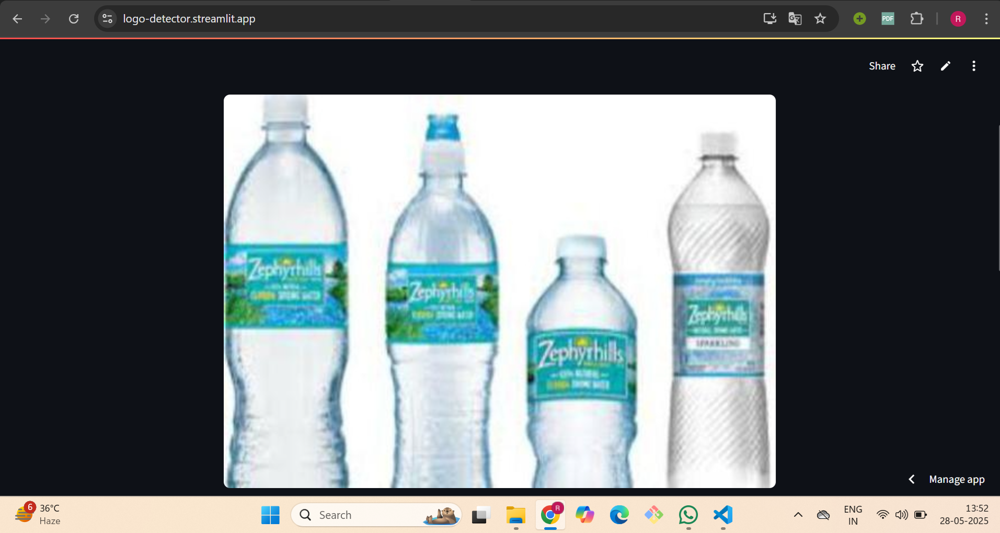

# Universal Logo Detector & Brand Recognition App

A modular Streamlit application for detecting logos in images using **RT-DETRv2** object detection model and recognizing brand names through Google Gemini AI.

---

## Overview

This project provides:

* **Local Model Training**: Jupyter notebooks for data preprocessing, model training, and evaluation.
* **Local UI**: A Streamlit app (`logo_detector_app/streamlit_app.py`) that uploads images, runs object detection, draws bounding boxes, and displays results.
* **GenAI Integration**: A Python module (`genai_utils.py`) that sends processed images to Google Gemini (`gemini-2.0-flash-001`) for brand name extraction.

---

## Solution Approach

1. **Dataset Conversion**

   * Original dataset in Pascal VOC format (images + XML annotations).
   * Converted XML annotations to COCO format via a custom script.
   * Built a pandas DataFrame containing `file_path` and its COCO-formatted annotation JSON.

2. **Preprocessing**

   * Loaded each image from `file_path`, converted to pixel tensors and corresponding labels as required by the RT-DETRv2 model.
   * Save preprocessed dataset into pickle file.

3. **Model Training on Subsets**

   * Trained initially on Kaggle GPU, but hit CUDA OOM with the full dataset.
   * Split data into 5% subsets:

     1. Train on the first 5%, save checkpoint.
     2. Load checkpoint and train on the next 5%, save checkpoint.
   * Performed an additional 25% training run (without interim evaluation) on saved checkpoint that took \~6 hours.
   * Final model checkpoint (trained on 35% of the data) is saved at `src/model/model.safetensors`.

4. **Inference & UI**

   * Loaded the final checkpoint in the Streamlit app to detect logos and draw red bounding boxes.
   * Integrated Google Gemini (`gemini-2.0-flash-001`) to extract brand names from boxed images.

5. **Deployment**

   * App deployed on Streamlit Cloud with `GEMINI_API_KEY` as an environment variable.
   * Public URL: [https://logo-detector.streamlit.app/](https://logo-detector.streamlit.app/)

## Repository Structure

```plaintext
-Universal-Logo-Detector/
├── logo_detector_app/
│   ├── config.py
│   ├── genai_utils.py
│   ├── model_detection.py
│   ├── model_utils.py
│   ├── requirements.txt
│   └── streamlit_app.py
├── src/
│   ├── model/
│   │   ├── model.safetensors   # Tracked via Git LFS
│   │   ├── config.json
│   │   ├── preprocessor_config.json
│   │   └── training_args.bin
│   └── notebooks/
│       ├── data-preprocessing-logo.ipynb
│       ├── model-training.ipynb
│       ├── further-model-training.ipynb
│       ├── inference.ipynb
│       └── requirements.txt
├── .gitignore
├── .gitattributes
├── README.md
└── LICENSE
```

---

## Visual Examples

Below are the three key visual outputs from the pipeline

1. **Original upload image**  
    


2. **Model prediction (boundary boxes)**  
    


3. **Image after GenAI validation**  
    
---

## Setup & Execution

1. **Clone the repository**:

   ```bash
   git clone https://github.com/Rahul-Jain-1/Universal-Logo-Detector.git
   cd Universal-Logo-Detector
   ```

2. **Initialize Git LFS & pull model**:

   ```bash
   git lfs install
   git lfs pull
   ```

3. **Create and activate a virtual environment**:

   ```bash
   python3 -m venv .venv
   source .venv/bin/activate    # Linux/Mac
   .\.venv\\Scripts\\activate  # Windows
   ```

4. **Install dependencies**:

   ```bash
   pip install -r logo_detector_app/requirements.txt
   ```

5. **Run local training notebooks** in order (located under `src/notebooks/`):

   * `src/notebooks/data-preprocessing-logo.ipynb`
   * `src/notebooks/model-training.ipynb`
   * `src/notebooks/further-model-training.ipynb`
   * `src/notebooks/inference.ipynb`

6. **Launch the Streamlit app locally** the Streamlit app locally\*\*:

   ```bash
   streamlit run logo_detector_app/streamlit_app.py
   ```


---

## Public URL

*Deployed at:*
[https://logo-detector.streamlit.app/](https://logo-detector.streamlit.app/)


---

## Model & GenAI Details

* **Object Detection**: Custom RT-DETRv2 fine-tuned on a logo dataset.
* **Checkpoint**: `src/model/model.safetensors` (tracked via LFS).
* **GenAI Model**: `gemini-2.0-flash-001` via `google-generativeai` SDK.
* **API Key**: Handled through `GEMINI_API_KEY` (add key in environment variable -- .env file) .

---

## Assumptions & Challenges

* Annotation format: original dataset in Pascal VOC; conversion to COCO must preserve classes.
* GPU memory: full-dataset training OOM’d on kaggle P100 16 GB GPUs, so we used a subset-by-subset approach.
* Streamlit Cloud: image processing + GenAI calls add latency; consider caching or batch modes.
* Model files are managed via Git LFS to avoid GitHub size limits.

---

## Potential Improvements

* Full-dataset finetuning on multi-GPU or TPU hardware.
* Batch processing & caching of repeated inferences.
* Model pruning, quantization, or distillation for faster inference & smaller size
* Hyperparameter sweeps (learning rate, weight decay, scheduler) via tools.
* Cache recent GenAI responses to reduce API calls and cost
* Support multiple GenAI models/languages.
* Add CI/CD for testing and deployment.

---

